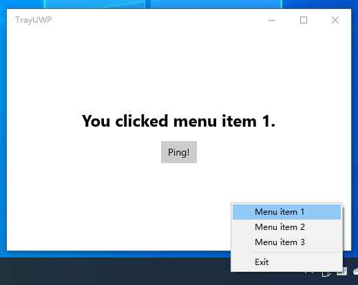

# Show an icon in the tray for UWP/为UWP显示托盘图标

# How does it work/如何工作

By declaring the `runFullTrust` capability in `Package.appxmanifest`, we can launch a bundled non-UWP executable when launching the app. We rely on that non-UWP exe to show the tray icon and its context menu.

We also declared a command line alias for this UWP, so we can use command line arguments to communicate with the UWP part in the non-UWP part. It can be done way more elegantly by using AppServices.

通过在`Package.appxmanifest`里声明`runFullTrust`能力，我们可以在应用启动的同时启动一个非UWP的可执行文件；我们依赖它显示托盘图标和上下文菜单。

我们同时为应用声明了一个命令行别名，以便于我们在非UWP的部分中和UWP部分通讯；这可以通过AppServices更优雅地实现。
